# GTFS Lens – User Guide

> **Beta Release** | Free to use | [gtfs-lens.strada360.com](https://gtfs-lens.strada360.com) | Built by [Strada360](https://www.strada360.com)

---

## Table of Contents

1. [Overview](#overview)
2. [Getting Started](#getting-started)
   - [Get Started](#get-started)
3. [Repository Management](#repository-management)
   - [Public Repositories](#public-repositories)
   - [Private Repositories](#private-repositories)
   - [Loading a Feed](#loading-a-feed)
4. [The Five Views](#the-five-views)
   - [Calendar View](#calendar-view)
   - [Timetable View](#timetable-view)
   - [Map View](#map-view)
   - [Stop View](#stop-view)
   - [Stop & Ask AI](#stop--ask-ai)
5. [Using GTFS Lens as a UI Validator](#using-gtfs-lens-as-a-ui-validator)
6. [Frequently Asked Questions](#frequently-asked-questions)
7. [Reporting Issues & Contributing](#reporting-issues--contributing)
8. [About Strada360](#about-strada360)

---

## Overview

**GTFS Lens** is a free, AI-powered transit data platform designed for people working inside transit agencies. It lets you explore, query, and visually validate your GTFS feed without needing to open a spreadsheet or write a single line of SQL.

Think of GTFS Lens as a **UI-based validator** — a complement to structural tools like the [Canonical GTFS Validator](https://github.com/MobilityData/gtfs-validator). Where the Canonical Validator catches specification non-conformances and structural errors, GTFS Lens lets you see what your data actually represents in context — surfacing real-world issues that may not trigger a validation rule but still affect the rider experience.

---

## Getting Started

### Get Started

To unlock the full functionality of GTFS Lens, please sign in using one of the following providers:

- **Google**
- **Facebook**
- **Microsoft** — personal accounts only (Outlook, Hotmail, Live)

---

## Repository Management

GTFS Lens organises feeds into **repositories** — a repository holds a GTFS feed and is the starting point for all views and queries. You can create multiple repositories to manage different feeds or different versions of the same feed.

### Public Repositories

A public repository loads a feed from a publicly available GTFS source. GTFS Lens integrates directly with the **[Mobility Database](https://mobilitydatabase.org/)** — the authoritative catalogue of GTFS feeds maintained by MobilityData — so you can find and load your agency's published feed in seconds without hunting down a download URL.

**To create a public repository:**

1. From your dashboard, click **New Repository**.
2. Select **Public** as the repository type.
3. Search for your agency by name in the Mobility Database search field.
4. Select the correct feed from the results list.
5. Click **Load Feed** to import and process the data.
6. Once processing is complete, the repository will appear on your dashboard ready to explore.

If the feed is not found please contact us at support@strada360.com with the details of the agency and the feed name.

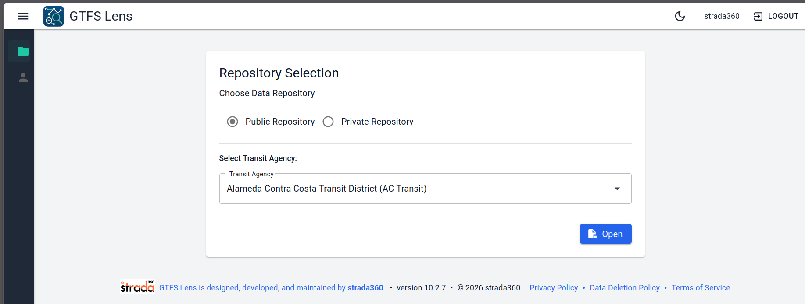

---

### Private Repositories

A private repository allows you to upload and review a GTFS feed that has not yet been published — ideal for validating draft or upcoming schedule changes before they go live, without exposing the data publicly.

**To create a private repository:**

1. From your dashboard, click **New Repository**.
2. Select **Private** as the repository type.
3. Enter a name and optional description for the repository.
4. Upload your GTFS `.zip` file.
5. Click **Load Feed** to import and process the data.
6. Once processing is complete, the repository will appear on your dashboard.

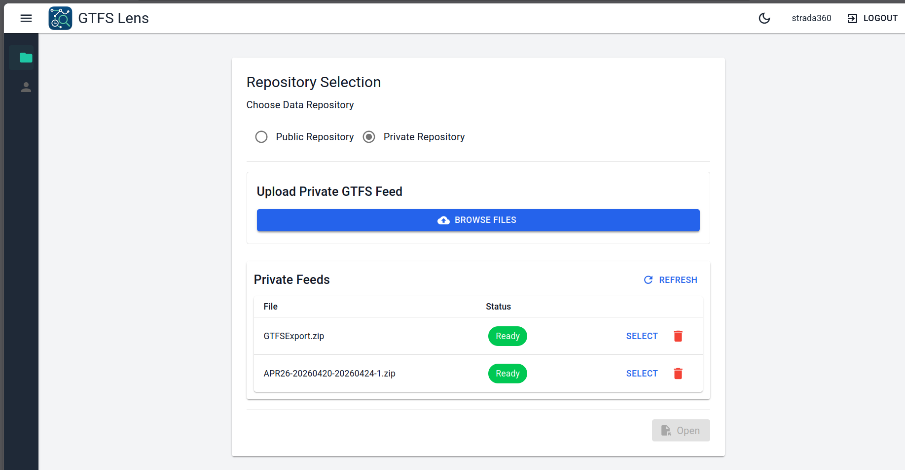

> **Why use a private repository?**
> - Review and validate an upcoming schedule change before publication.
> - Compare draft feeds against your live feed side by side.
> - Keep sensitive or embargoed timetable changes confidential within your team.
> - Identify data issues early in the production cycle, not after publishing.

---

### Loading a Feed

Feed processing time varies depending on the size of the GTFS file. A progress indicator will display on the repository card during import. You will receive a notification when the feed is ready to explore.

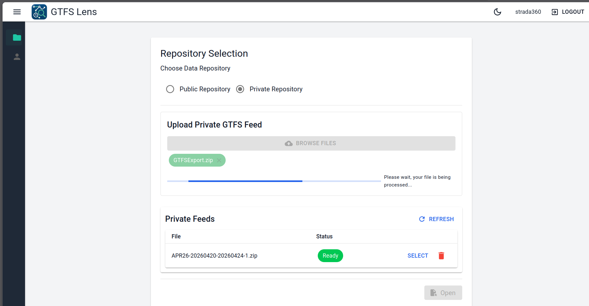
---

## The Five Views

Once a repository is loaded, GTFS Lens gives you five purpose-built views to explore your data. Each view is accessible from the left-hand navigation panel.

---

### Calendar View

The Calendar View displays your feed's service calendar as a visual, day-by-day grid. Each day is annotated with the service IDs active on that date, derived from your `calendar.txt` and `calendar_dates.txt` files.

**Use this view to:**
- Confirm which services are running on any given date.
- Spot missing service coverage — gaps, holidays, or unintended blackout dates.
- Verify that service exceptions (e.g. public holidays, special events) are correctly defined.
- Cross-check seasonal schedule changes.

**How to use:**
1. Open a repository and select **Calendar** from the navigation panel.
2. Navigate between months using the arrows at the top of the calendar.
3. Click on any day to see the list of active service IDs and their associated routes.

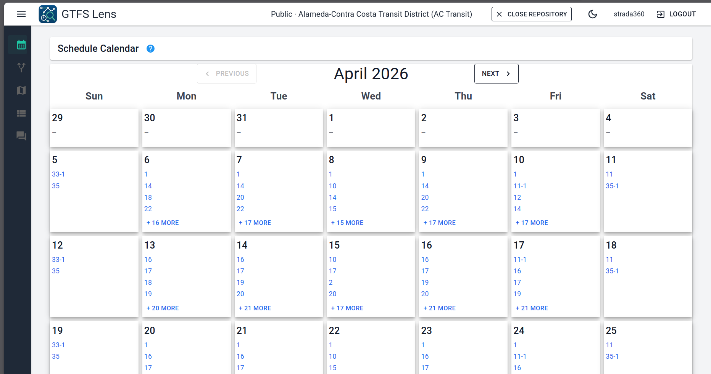

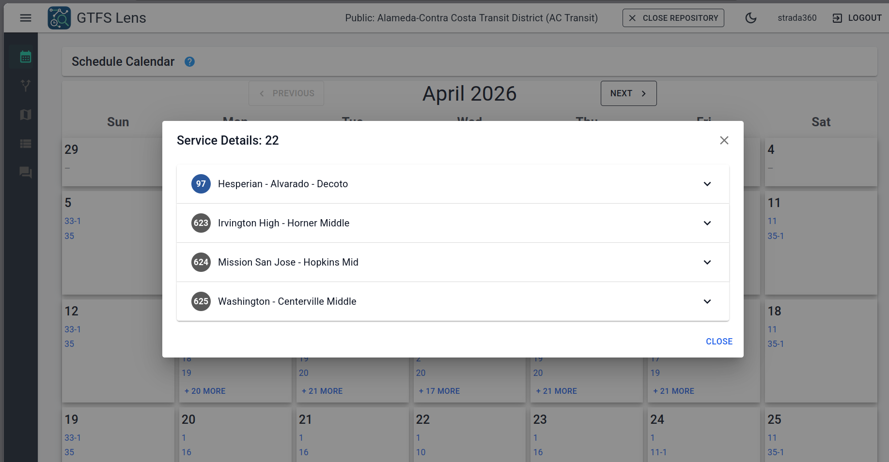

File in use here are:
- `calendar.txt`
- `calendar_dates.txt`
- `routes.txt`
- `trips.txt`
- `stop_times.txt`
- `stops.txt`

---

### Timetable View

The Timetable View renders your GTFS data as a formatted timetable — the same way it might appear on a printed schedule or a digital journey planner. This makes it easy to visually confirm that the times, stop sequences, and service patterns in your feed match what you intend to publish to riders.

**Use this view to:**
- Preview how timetables look for any route, direction, and service type.
- Filter by calendar date, service type (weekday / Saturday / Sunday), or route.
- Spot missing trips, incorrect departure times, or out-of-sequence stops.
- Verify first and last service times for any route.

**How to use:**
1. Select **Timetable** from the navigation panel.
2. Use the query bar to filter by route, date, or service type.
3. The timetable renders with stops as rows and trips as columns, or vice versa depending on your selection.
4. Scroll horizontally to view all trips across the service day.

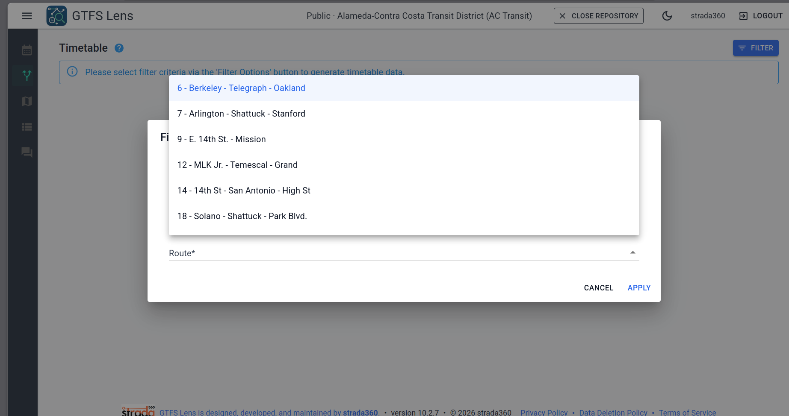

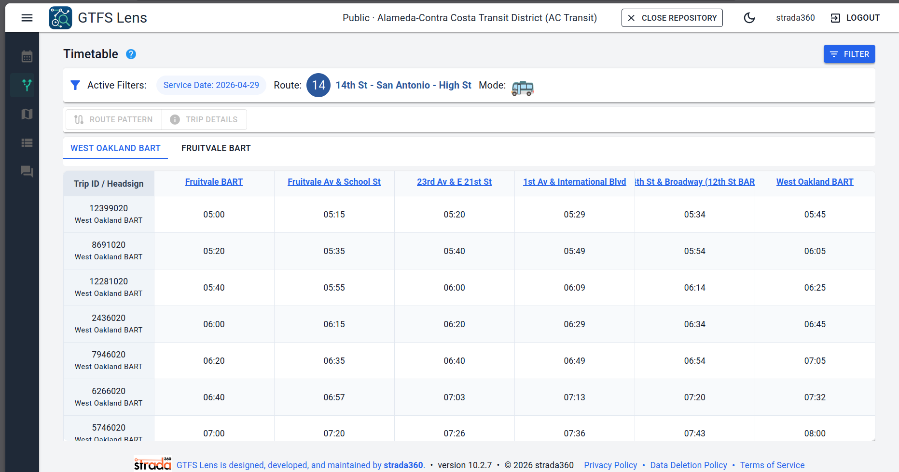

File in use here are:
- `routes.txt`
- `calendar.txt`
- `calendar_dates.txt`
- `trips.txt`
- `stop_times.txt`
- `stops.txt`

---

### Map View

The Map View renders your route shapes on an interactive map, using the geometry defined in your `shapes.txt` file. You can filter routes by calendar date, service type, or route ID to see exactly which paths are active and how they align geographically.

**Use this view to:**
- Verify route shapes are drawn correctly and match the intended path.
- Spot missing or misaligned shape geometries.
- Identify routes with no shape data defined.
- Filter by date or service type to view the active network on a specific day.

**How to use:**
1. Select **Map** from the navigation panel.
2. Use the filter panel to select a date, service type, and specific route.
3. The Route is rendered as coloured line using the colors defined in the routes.txt file on the map. Click a route to view its details.
4. Zoom and pan to inspect specific areas of the network.

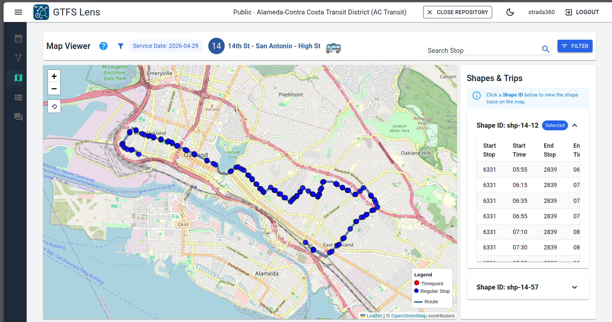

Files in use here are:
- `routes.txt`
- `calendar.txt`
- `calendar_dates.txt`
- `shapes.txt`
- `stop_times.txt`
- `trips.txt`
- `stops.txt`

---

### Stop View

The Stop View lets you explore your GTFS data from the perspective of an individual stop. For any stop in your feed, you can see every route that serves it, along with the full list of passing times across the service day.

**Use this view to:**
- Validate that the correct routes are assigned to each stop.
- Confirm passing times are accurate and complete.
- Identify stops with missing stop times or no route assignments.
- Check that stops belonging to a parent station are correctly grouped.

**How to use:**
1. Select **Stop** from the navigation panel.
2. Search for a stop by name or stop ID using the search field.
3. The stop detail panel displays all routes serving the stop, along with a timetable of passing times.
4. Filter by service type or date to narrow the results.

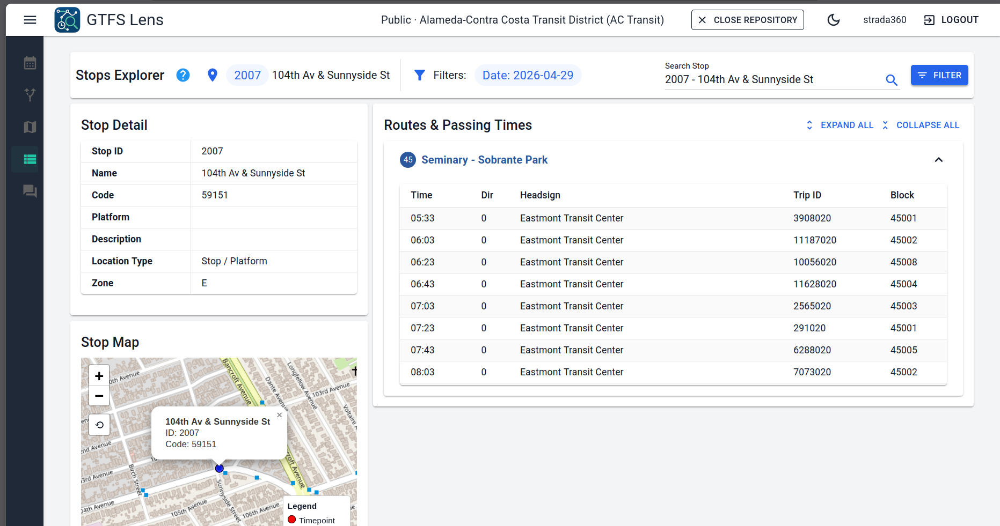

Files in use here are:
- `routes.txt`
- `calendar.txt`
- `calendar_dates.txt`
- `stop_times.txt`
- `trips.txt`
- `stops.txt`

---

### Stop & Ask AI

Stop & Ask AI is a conversational query interface that lets you ask plain-language questions about your feed and get instant, accurate answers — no SQL expertise or data engineering background required.

**Example questions you can ask:**
- *"How often does the 72M run on weekday mornings?"*
- *"What is the last trip departing Fruitvale BART on Route 51A on a Saturday?"*
- *"Which routes serve Eastmont Transit Center?"*
- *"Which services are active on Sundays and how many routes do they cover?"*
- *"How many trips are scheduled on a weekday compared to a Saturday?"*

**How to use:**
1. Select **Stop & Ask** from the navigation panel.
2. Type your question in natural language into the query field.
3. Press **Enter** or click **Ask**.
4. GTFS Lens returns an answer drawn directly from your feed, with supporting data where relevant.
5. Follow-up questions are supported — the AI maintains context across your session.

Some examples of Stop & Ask AI answers:

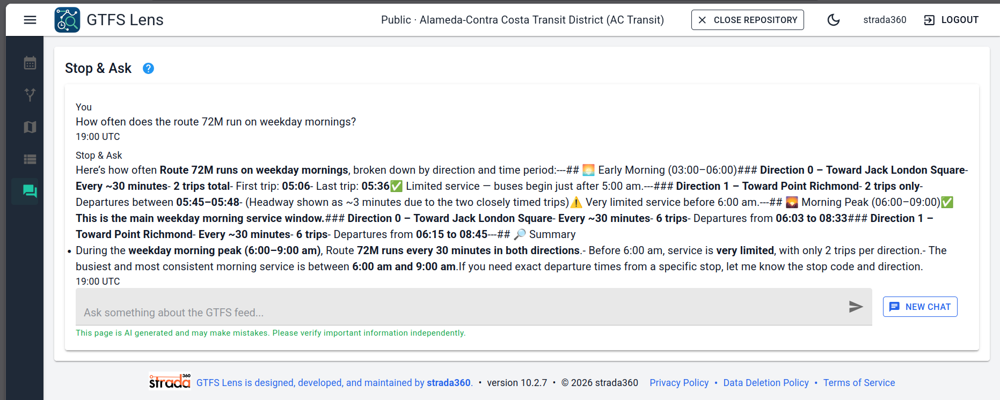
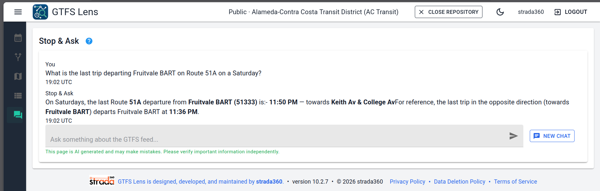
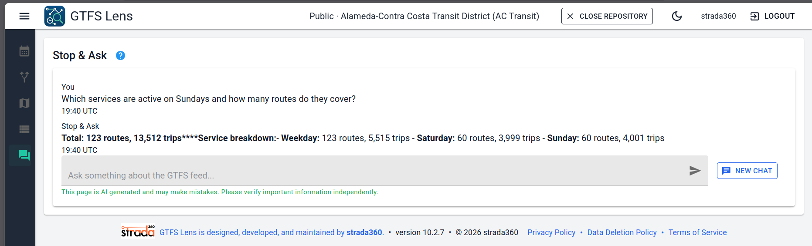
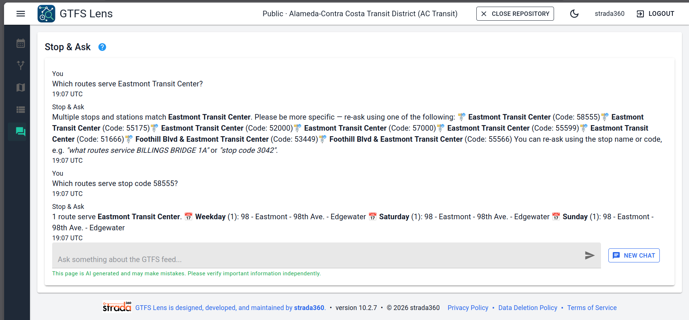
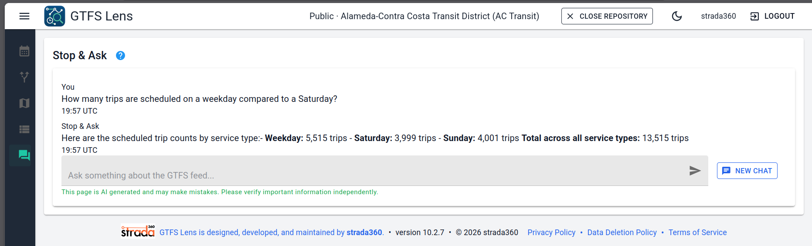

---

## Using GTFS Lens as a UI Validator

GTFS Lens is designed to work alongside the [Canonical GTFS Validator](https://github.com/MobilityData/gtfs-validator) as part of a complete data quality workflow:

| Step | Tool | Purpose |
|------|------|---------|
| **1. Validate** | Canonical GTFS Validator | Catch specification non-conformances and structural errors |
| **2. Explore** | GTFS Lens | Visually inspect and query the feed to understand what the data actually represents |
| **3. Improve** | Your scheduling system | Make targeted, confident corrections informed by both tools |
| **4. Re-validate** | Canonical GTFS Validator + GTFS Lens | Confirm the corrected feed passes both structural and visual review |

This combination is particularly valuable for smaller agencies that may not have dedicated data engineering capacity — GTFS Lens lowers the barrier to meaningful engagement with feed quality without requiring technical expertise.

---

## The Importance of Rich and Complete GTFS Data

GTFS Lens is only as insightful as the data it reads. While the platform can surface patterns and inconsistencies from any valid GTFS feed, the **quality, completeness, and descriptiveness of the underlying data directly determines the quality of the answers** — particularly when using Stop & Ask AI.

### What "Rich" Data Means in Practice

A structurally valid GTFS feed can still be semantically incomplete. Fields that the specification defines as optional are often left blank, and fields that accept free-form text are frequently populated with opaque identifiers rather than human-readable values. The result is a feed that passes validation but cannot answer meaningful questions.

### A Real-World Example: `service_id` and School Routes

One of the clearest illustrations of this gap involves the `service_id` field in `calendar.txt` and `trips.txt`. The GTFS specification defines `service_id` as a unique identifier — but it places no requirement on the format or meaning of that identifier. Agencies often populate this field with numeric codes that are meaningful only to their internal scheduling system.

Consider AC Transit's feed. The agency operates 46 school routes in the 600–699 series that run only when schools are in session. However, because the `service_id` values in the feed are numeric and carry no semantic label, the AI cannot distinguish a school-day service from a weekend service by the data alone. A natural question like:

> *"Are school routes running on April 14th?"*

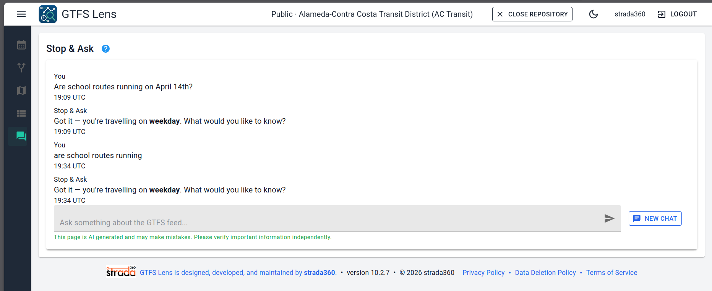

...cannot be answered reliably — not because the AI lacks capability, but because the specification does not require `service_id` to carry descriptive meaning. The data simply does not contain the information needed to answer the question.

Similarly, AC Transit operates a number of Transbay routes that cross the Bay Bridge to San Francisco. However, because "Transbay" is an internal classification not encoded as a structured field in the GTFS feed, a question like:

> *"How many Transbay routes operate on Sundays?"*

...returns no answer. The AI has no way to identify which routes are Transbay services without that distinction existing in the data — `route_desc` or a dedicated classification field could solve this, but the current specification does not mandate it.

### A Gap in the Specification — and an Opportunity

This is an example of where **the GTFS specification itself limits what AI can do with transit data**. A richer specification might define a `service_type` field — or recommend conventions for `service_id` naming — that would allow tools like GTFS Lens to distinguish between weekday, weekend, holiday, school-day, and special-event services without requiring agencies to encode that logic elsewhere.

Until the specification evolves, agencies can improve AI query quality by:

- Using descriptive `service_id` values where possible (e.g. `weekday`, `school_day`, `saturday`) rather than opaque numeric codes.
- Populating optional descriptive fields such as `trip_headsign`, `route_long_name`, and `route_desc` consistently.
- Ensuring `calendar_dates.txt` exceptions are fully populated for holidays and special events.

GTFS Lens surfaces these gaps visually — making it easier for agencies to see where their data is thin and where enrichment would unlock better insights for planners, riders, and AI-powered tools alike.

> 💡 **We believe tools like GTFS Lens demonstrate the real-world case for evolving the GTFS specification to support richer, more semantically meaningful data. We welcome discussion on this topic in the [Discussions](../../discussions) tab.**

---

## Frequently Asked Questions

**Is GTFS Lens free?**
Yes. GTFS Lens is completely free to use during the beta period and beyond.

**What GTFS files are supported?**
GTFS Lens supports standard GTFS Schedule (`.zip`) feeds conforming to the [GTFS Schedule specification](https://gtfs.org/schedule/reference/). GTFS-RT support is not currently available.

**How long does feed processing take?**
Processing time depends on feed size. Most feeds are ready within a few minutes. Large feeds (e.g. national or regional aggregates) may take longer.

**Can I load multiple feeds?**
Yes. You can create multiple repositories and switch between them from your dashboard.

**Is my private feed data secure?**
Private repository feeds are stored securely and are only accessible to your account. They are never shared publicly or with other users.

**Does GTFS Lens work with feeds from the Mobility Database?**
Yes. The public repository flow integrates directly with [mobilitydatabase.org](https://mobilitydatabase.org/) to retrieve published feeds by agency name.

**The AI gave me an unexpected answer — what should I do?**
Stop & Ask AI answers are derived directly from your feed data. An unexpected answer may indicate a data quality issue worth investigating. You can also raise it as a bug via our [GitHub Issues](../../issues) page.

---

## Reporting Issues & Contributing

GTFS Lens is in active beta development and your feedback directly shapes the product roadmap.

- **Bug reports:** Please open an issue using the [Bug Report template](../../issues/new?template=bug_report.md). Include your feed source (public or private), the view or feature affected, and steps to reproduce.
- **Feature requests:** Open an issue using the [Feature Request template](../../issues/new?template=feature_request.md).
- **General feedback:** Start a discussion in the [Discussions](../../discussions) tab.
- **Pull requests:** See [CONTRIBUTING.md](./CONTRIBUTING.md) for guidelines.

---

## About strada360

[strada360](https://www.strada360.com) is a transit systems integrator, data analytics expert, and GTFS publisher. We build products and services for transit agencies with data at the core of everything we do.

GTFS Lens is part of the **strada NexTrip** product suite. To learn more about our broader offerings — including GTFS & GTFS-RT publishing, real-time vehicle tracking, and scheduling system integration — visit [strada360.com](https://www.strada360.com).

---

*GTFS Lens is a beta product. Features and documentation are subject to change. Last updated: April 2026.*
