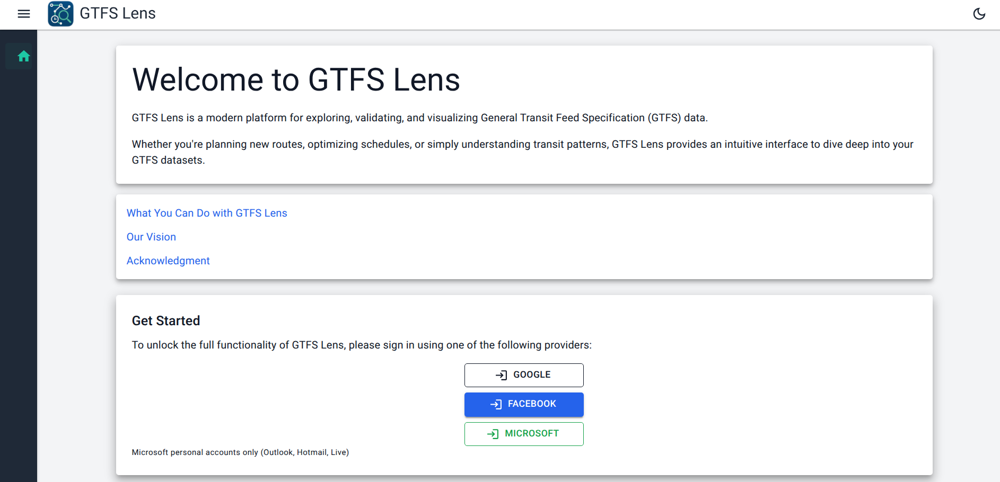

# 🔍 GTFS Lens

**An AI-powered transit data platform for transit agencies — free, open, and built on GTFS.**

> **Beta Release** | Free to use | Built by [strada360](https://www.strada360.com)

[](https://gtfs-lens.strada360.com)
[](./LICENSE)
[]()

---


---

## What is GTFS Lens?

GTFS Lens lets anyone inside a transit agency **see and understand their GTFS feed** — without opening a spreadsheet or writing a single line of SQL. It acts as a **UI-based validator**, complementing structural tools like the [Canonical GTFS Validator](https://github.com/MobilityData/gtfs-validator) by making your data visually navigable and queryable in plain language.

GTFS Lens currently focuses on the following core GTFS schedule files:
- feed_info.txt
- agency.txt
- calendar.txt
- calendar_dates.txt
- routes.txt
- stops.txt
- shapes.txt
- stop_times.txt
- trips.txt

---

## Five Views. One Feed.

| View | What it does |
|------|-------------|
| 📅 **Calendar** | See which services are active day by day |
| 🗓️ **Timetable** | Preview schedules by route, date, or service type |
| 🗺️ **Map** | Visualise route shapes on an interactive map |
| 🚏 **Stop** | Inspect routes and passing times from a stop's perspective |
| 🤖 **Stop & Ask AI** | Ask plain-language questions, get instant answers from your feed |

---

## Public & Private Repositories

- **Public** — Load any published agency feed directly from the [Mobility Database](https://mobilitydatabase.org/) in seconds.
- **Private** — Upload draft or unpublished feeds to validate upcoming schedule changes before they go live.

---

## Getting Started

1. Visit [gtfs-lens.strada360.com](https://gtfs-lens.strada360.com)
2. Create a free account
3. Create a repository — public or private
4. Start exploring your feed

📖 For full instructions, see the [User Guide](./USER_GUIDE.md).

---

## Data Quality Workflow

GTFS Lens is designed to work alongside the [Canonical GTFS Validator](https://github.com/MobilityData/gtfs-validator):

```
Validate (Canonical GTFS Validator)
    ↓
Explore (GTFS Lens — visual + AI review)
    ↓
Improve (fix in your scheduling system)
    ↓
Re-validate
```

---

## Contributing & Feedback

GTFS Lens is in active beta — your feedback shapes the roadmap.

- 🐛 [Report a bug](../../issues/new?template=bug_report.md)
- 💡 [Request a feature](../../issues/new?template=feature_request.md)
- 💬 [Start a discussion](../../discussions)
- 🤝 [Contributing guide](./CONTRIBUTING.md)

---

## About strada360

[strada360](https://www.strada360.com) is a transit systems integrator, data analytics expert, and GTFS publisher. Data is at the core of everything we do.

---

*GTFS Lens is a beta product. Last updated: April 2026.*
